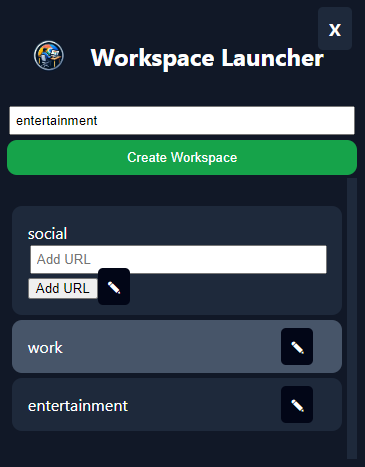
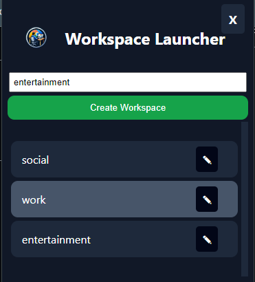

# Workspace Launcher Chrome Extension

## Overview

The Workspace Launcher Chrome Extension is a tool that allows users to organize and launch multiple sets of URLs, referred to as "workspaces," with a single click. This extension is designed to enhance productivity by providing a convenient way to open a group of related websites simultaneously.

## Features

- **Create Workspaces:** Organize your URLs into different workspaces based on projects, topics, or any other criteria.
- **Add URLs to Workspaces:** Easily add URLs to your workspaces to create sets of related websites.
- **Launch Workspaces:** Open all the URLs within a workspace in new tabs with a single click.

## Installation

1. Clone or download the repository to your local machine.
2. Open Chrome and navigate to `chrome://extensions/`.
3. Enable "Developer mode" at the top right.
4. Click "Load unpacked" and select the extension directory.

## Usage

1. Click on the extension icon in the Chrome toolbar.
2. Create a new workspace and give it a meaningful name.
3. Add URLs to the workspace.
4. Click on a workspace to open all associated URLs in new tabs.

## Screenshots

_Caption for Screenshot 1._

_Caption for Screenshot 2._

## Customization

To customize the extension icon for each workspace, follow the instructions in the [Customization](#customization) section of the extension's manifest file.

## Contributing

Contributions are welcome! If you have any ideas for improvements or find any issues, please open an issue or submit a pull request.

## License

This project is licensed under the [MIT License](LICENSE).

## Acknowledgments

- Special thanks to [Name] for the inspiration and guidance.

---

**Note:** Add additional sections or details as needed, and make sure to include appropriate links, images, and other resources. Update the file paths and names for screenshots accordingly.
